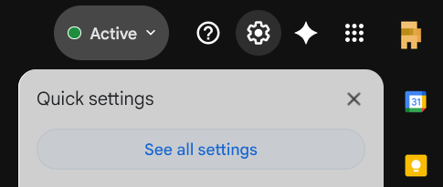
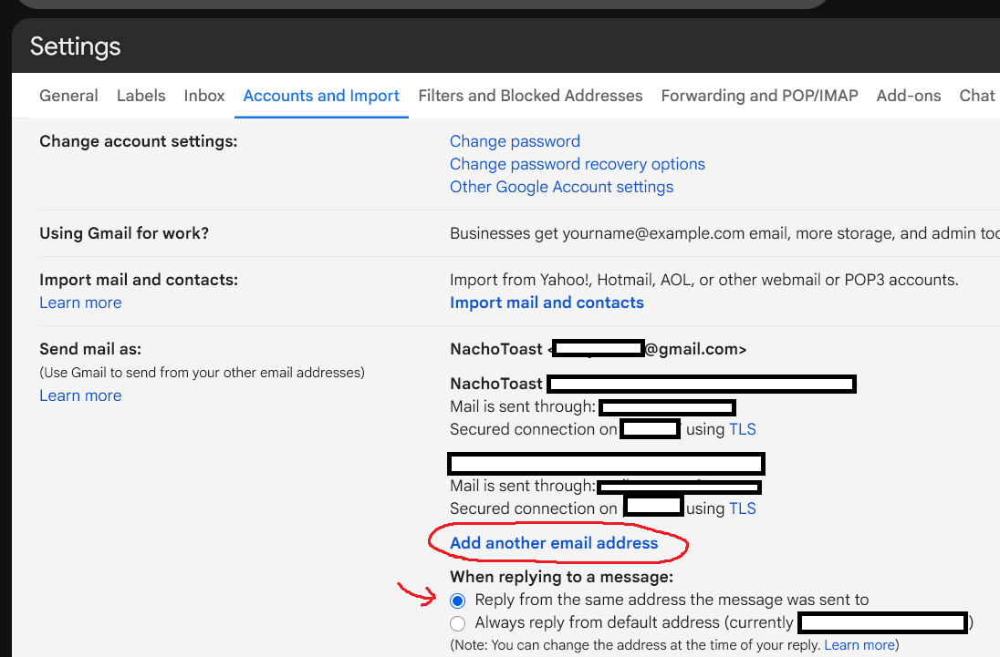
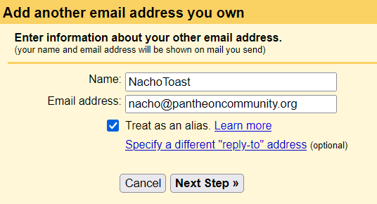
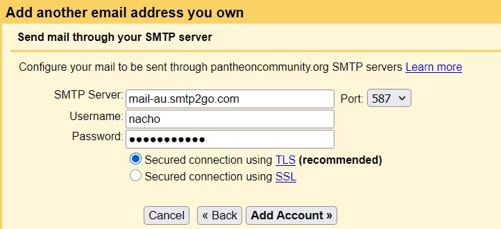
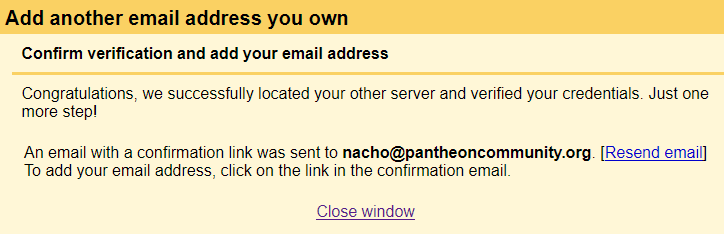
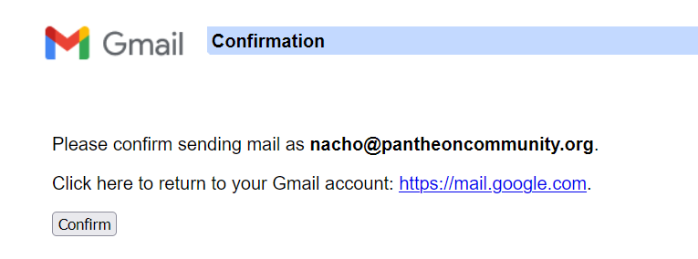
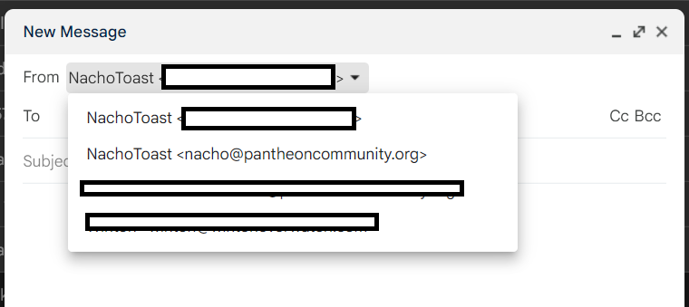

# Custom Pantheon Email Addresses

The one-stop guide to setting up your own **pantheoncommunity.org** email address! If you don't use gmail this guide will still help you, things will just look a little different.

1. Go to [your gmail inbox](https://mail.google.com/mail) and press **See all settings**

2. Check the "Reply from the same address" option (if you want) and then press the **Add another email address** button.

3. Choose the name and email you want (the email must match the one given to you by NachoToast).

4. Enter the SMTP server, username, and password that were given to you by NachoToast, keep port as 587 unless specified otherwise.

1. Now confirm the email (if you don't receive one, check your spam folder maybe?).

6. Now **refresh your inbox**, and you'll see a dropdown when sending new emails! Yippee!

